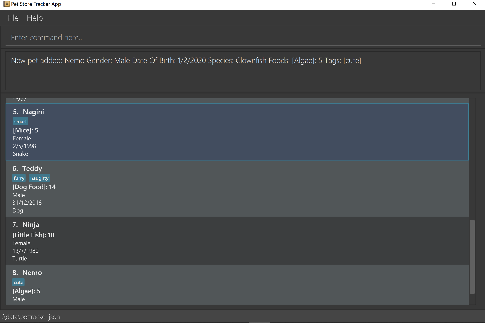

= Pet Store Helper
ifdef::env-github,env-browser[:relfileprefix: docs/]

https://travis-ci.org/AY1920S2-CS2103-W15-4/main[image:https://travis-ci.org/AY1920S2-CS2103-W15-4/main.svg?branch=master[Build Status]]
https://coveralls.io/github/se-edu/addressbook-level3?branch=master[image:https://coveralls.io/repos/github/se-edu/addressbook-level3/badge.svg?branch=master[Coverage Status]]

ifdef::env-github[]

endif::[]

ifndef::env-github[]
image::images/Ui.png[width="600"]
endif::[]

* This is a desktop application that targets pet store owners. It has a GUI but most of the
user interactions happen using a CLI (Command Line Interface).
* It is an application intended for pet store owners to manage their activities. (e.g. add pets, manage schedule, etc.)
* This application is based on 2 main systems, one that manages pets, and another one that organises showering schedules.

== Site Map

* <<UserGuide#, User Guide>>
* <<DeveloperGuide#, Developer Guide>>
* <<AboutUs#, About Us>>
* <<ContactUs#, Contact Us>>

== Acknowledgements

* Original source of the code is from AddressBook-Level3 project created by SE-EDU initiative at https://se-education.org
* Some parts of this sample application were inspired by the excellent http://code.makery.ch/library/javafx-8-tutorial/[Java FX tutorial] by
_Marco Jakob_.
* Libraries used: https://openjfx.io/[JavaFX], https://github.com/FasterXML/jackson[Jackson], https://github.com/junit-team/junit5[JUnit5]

== Licence : link:LICENSE[MIT]
